# Nimbus Admin — White-Label Chat Admin Dashboard

A React (Vite) admin console for managing the Nimbus white-label chat app. **All data is static/mocked in-memory** — there is no Node.js backend wired up yet, per current scope. Any email/password signs you in on the login screen.

## Run it

```bash
npm install
npm run dev
```

Opens at `http://localhost:5173`.

## What's here

10 screens:

- **Login** — static demo auth gate
- **Overview** — workspace stats, weekly message volume, recently active users
- **Users** — searchable/filterable user table
- **User detail** — edit role, suspend/reactivate, edit display name
- **Groups** — group cards with member/message counts
- **Group detail** — manage members, edit group-level permissions
- **Roles & permissions** — toggle what each role (Team Admin / Moderator / Member) can do
- **App branding** — edit app name, tagline, logo initial, and color palette, with a **live phone preview** that updates as you type
- **Webhooks** — add/edit/disable webhook endpoints and event subscriptions (UI only, no requests are actually sent)
- **App settings** — feature flags (encryption, read receipts, typing indicators, file sharing) and file size limits

## Screenshots

<table>
<tr>
<td align="center"><b>Login</b><br>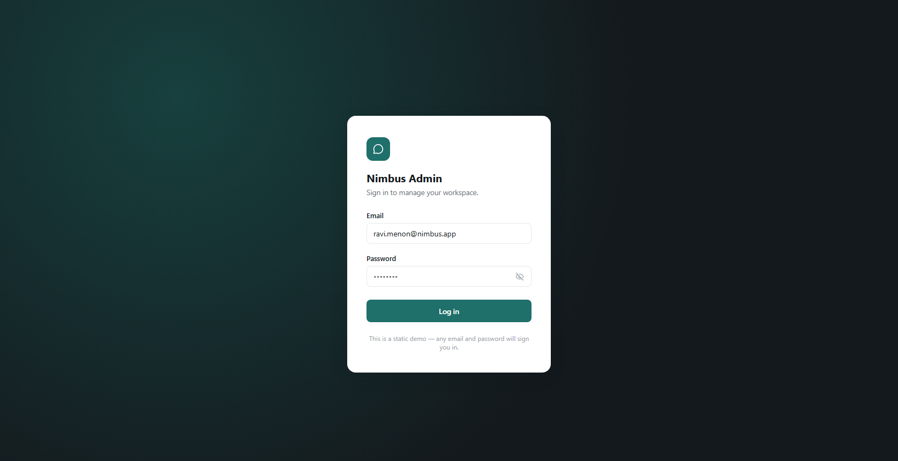</td>
<td align="center"><b>Overview</b><br>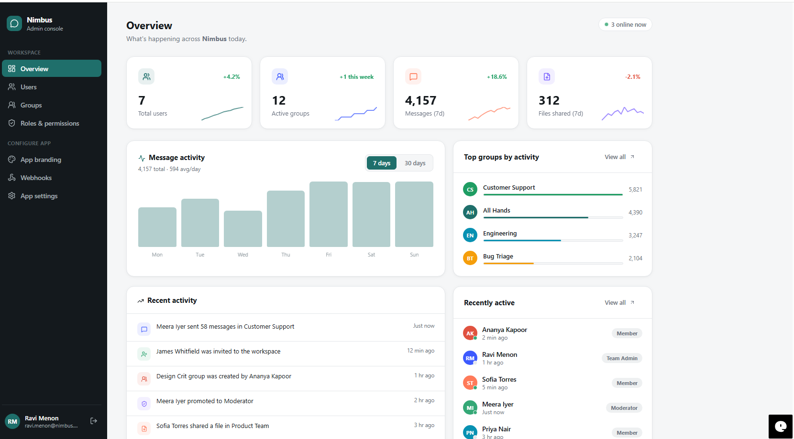</td>
</tr>
<tr>
<td align="center"><b>Users</b> — invite user<br>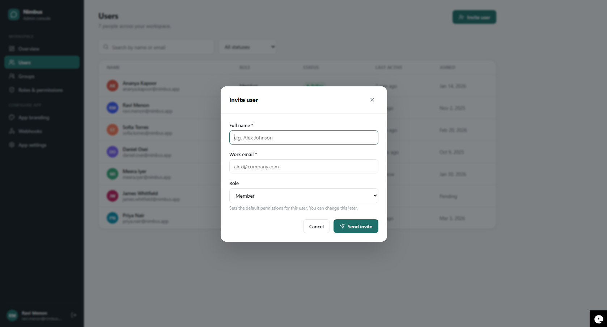</td>
<td align="center"><b>Groups</b><br>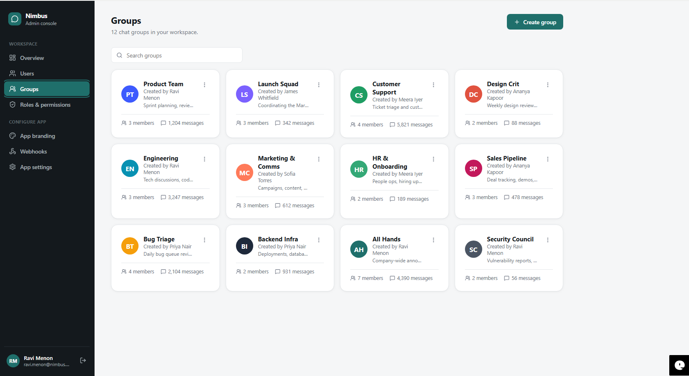</td>
</tr>
<tr>
<td align="center"><b>Groups</b> — create group<br>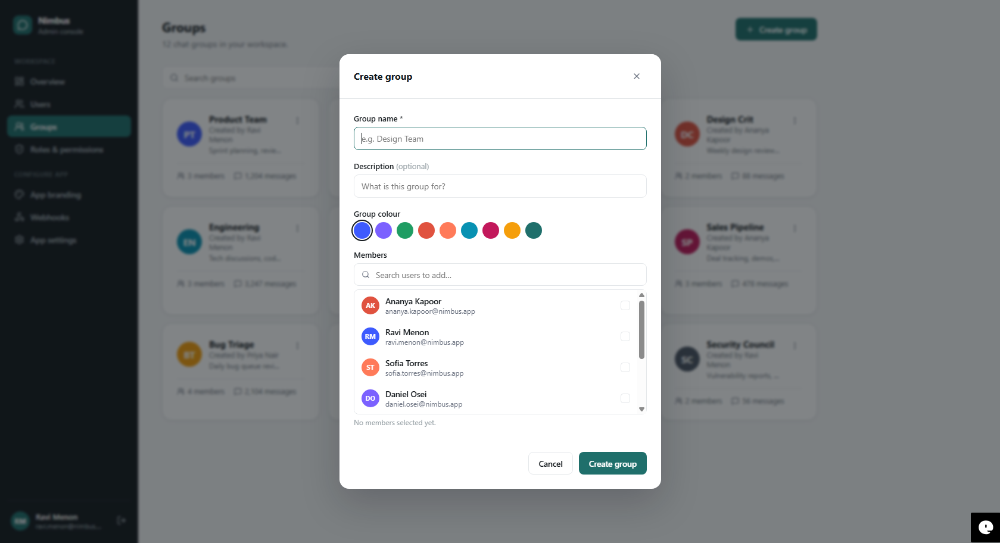</td>
<td align="center"><b>Group detail</b> — members & permissions<br>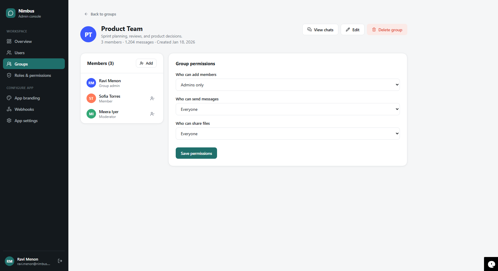</td>
</tr>
<tr>
<td align="center"><b>Group detail</b> — chat history (read-only)<br>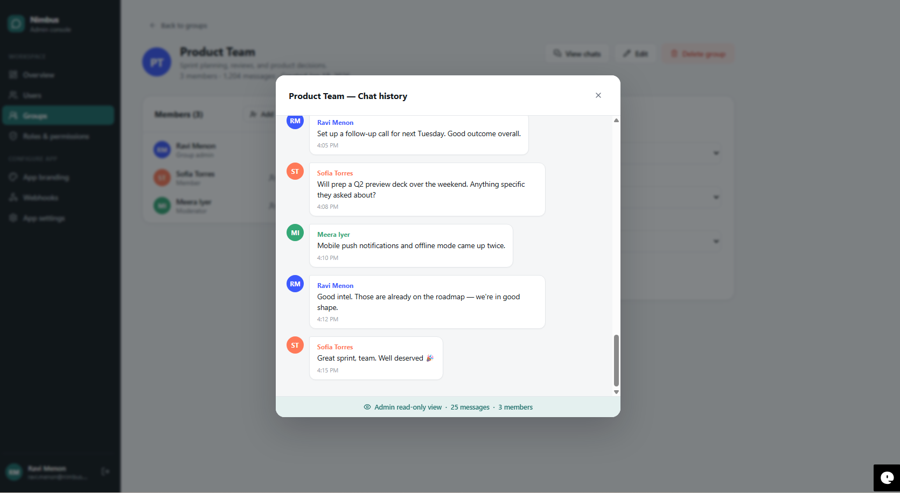</td>
<td align="center"><b>Roles & permissions</b><br>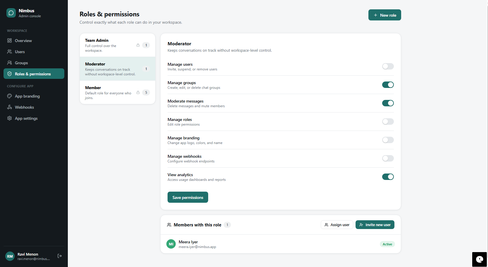</td>
</tr>
<tr>
<td align="center"><b>Roles & permissions</b> — new role<br>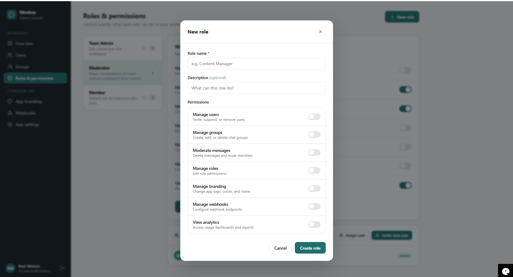</td>
<td align="center"><b>App branding</b> — live phone preview<br>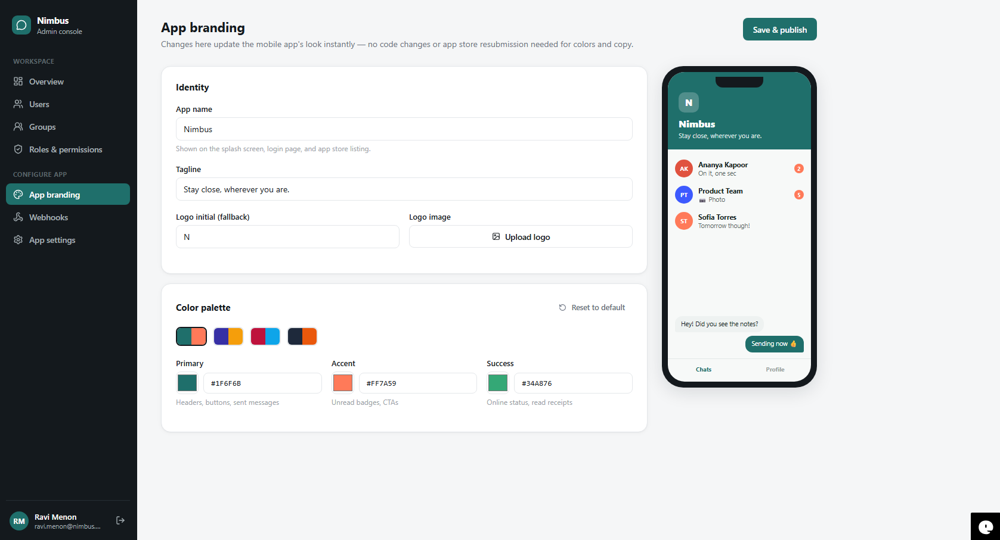</td>
</tr>
<tr>
<td align="center"><b>Webhooks</b><br>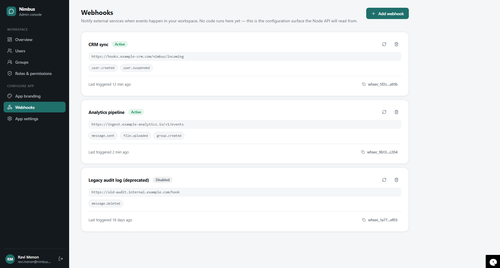</td>
<td align="center"><b>App settings</b><br>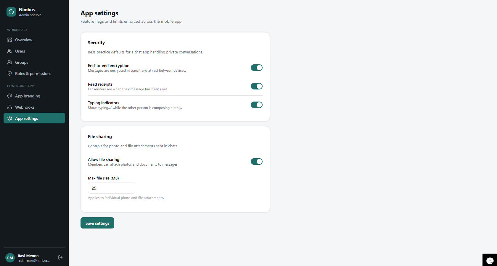</td>
</tr>
</table>

## How this connects to the mobile app

`src/context/ConfigContext.jsx` holds the same shape of data as the mobile app's `src/theme/brand.json`. The Branding and App Settings pages edit this in-memory config live — that's what "Save & publish" represents.

**Once the Node backend exists**, the wiring is:

1. Admin edits branding/settings here -> `PUT /config/branding` and `PUT /config/features`
2. Mobile app calls `GET /config/branding` once at launch (and optionally subscribes to a `branding.updated` webhook event to refresh without a restart)
3. Roles & Permissions here map to actual JWT claims / RBAC checks the Node API enforces on every request
4. Webhook rows here become real registered endpoints the API POSTs to when the matching event fires

## Not included (by design, per current scope)

- No Node.js/Express code — that's explicitly a separate phase
- No real authentication — the login form accepts anything
- Webhook "sends" are not real HTTP requests
- No persistence — refreshing the page resets all edits to defaults
